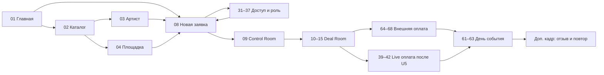
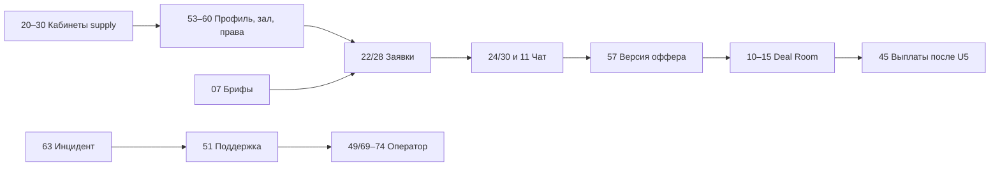

# Букер — карта экранов и переходов

Статус: проект навигации для детальных макетов, 30.09.2026. Сопоставлен с [атласом 75 семейств](SCREEN_REFERENCE_ATLAS.md), [планом развития](../product/MARKETPLACE_MATURITY_PLAN.md) и [контрактом](../product/CONTRACT.md). Названия путей в атласе — **целевые**, их наличие в текущем frontend надо сверить перед реализацией. HTML-атлас показывает композицию; кнопки в нём не доказывают наличие реального пользовательского перехода.

## Что считаем полным охватом

«Все экраны» нельзя подтвердить одним числом. На текущем этапе есть **75 семейств маршрутов** в HTML, **18 дополнительных детальных кадров** из плана развития и матрица состояний ниже. Одно семейство может требовать несколько отдельных кадров: например, регистрация с ошибкой, истёкший код, недоступный слот, Pending и Failed. Следующий дизайн-цикл закрывает реестр из 93 строк, затем проверяет каждое ребро графа и каждое применимое состояние. Новое состояние допускается добавлять только с владельцем, входом, выходом и критерием приёмки.

В таблицах `→` означает следующее действие пользователя; `↔` — возврат в контекст. Для каждого перехода действуют серверная проверка роли, права на объект, состояния календаря и версии оффера. После входа надо вернуть пользователя к сохранённому безопасному `next`, а не открывать произвольный URL.

## Главные пути

## Таблица входа и следующего шага: все 75 семейств

### Открытие, событие, сделка

| № | Экран | Вход | Основной выход | Гейт |
|---:|---|---|---|---|
| 01 | Главная | прямой URL, share | 02 или 08 | публично |
| 02 | Каталог | 01, 18, 05 | 03/04, 05, 06 | только опубликованное |
| 03 | Исполнитель | 02, 05, 17 | 08; портфолио как детальный кадр | права медиа, дата из API |
| 04 | Площадка | 02, 05, 17 | 08 | зал, представитель, слот |
| 05 | Сравнение | 02/03/04 | 03/04 или 08 | сравнивать одинаковые факты |
| 06 | Совместная подборка | 02, ссылка | 03/04; 08 после входа | token, срок, отзыв доступа |
| 07 | Открытые брифы | публично, supply-кабинет | детальный кадр отклика, затем 22/28 | добровольная публикация |
| 08 | Новая заявка | 01/03/04/07/16/17 | 31–37 при нужде, затем 09 | черновик, дата и цена повторно с API |
| 09 | Control Room | 08/16/61/46 | 10, 19, 61, 63 | участник видит свой scope |
| 10 | Deal Room обзор | 09/19/22/28/46 | 11–15 | доступ к конкретной booking |
| 11 | Переписка сделки | 10/19/24/30 | 12, 51 | чат не изменяет условия |
| 12 | Условия | 10/11/57 | 14, 40 или 64 | принять только актуальную версию |
| 13 | Документы | 10/12/51 | 10 или защищённая выдача | ACL на каждый файл |
| 14 | Деньги сделки | 10/12/38 | 64 до U5; 39/40 после U5; 44 | режим из API |
| 15 | Спор | 10/14/61/62 | 51, 74 | доказательства и права сторон |

### Кабинеты

| № | Экран | Вход | Основной выход | Гейт |
|---:|---|---|---|---|
| 16 | Кабинет заказчика | 31–35, 09 | 08, 09, 19, 38 | свои события |
| 17 | Избранное | 16/02/03/04 | 03/04/08 | снятый профиль не выбирается |
| 18 | Сохранённые поиски | 16/02 | 02, 47 | уведомления по согласию |
| 19 | Сообщения заказчика | 16/09/46 | 11 или 51 | выбранная сделка/позиция |
| 20 | Кабинет исполнителя | 34/36, 46 | 21–24, 53–58, 45 | организация и права |
| 21 | Календарь исполнителя | 20/55 | 22, 55 | held/confirmed конфликтует на сервере |
| 22 | Заявки исполнителя | 20/07/46 | 24, 57, 10 | срок и доступ к заявке |
| 23 | Услуги | 20/53 | 57, 53 | версия тарифа |
| 24 | Сообщения исполнителя | 20/22/46 | 11, 57 | только свой request/deal |
| 25 | Кабинет площадки | 34/36, 46 | 26–30, 59/60 | claim/организация |
| 26 | Календарь площадки | 25/60 | 28, 60 | ресурс = конкретный зал |
| 27 | Залы | 25/59 | 60, 26 | полнота публикации |
| 28 | Заявки площадки | 25/07/46 | 30, 57, 10 | зал, слот, срок |
| 29 | Статистика площадки | 25 | 28, 26 | малая выборка скрывает рейтинг |
| 30 | Сообщения площадки | 25/28/46 | 11, 57 | только свой зал/deal |

### Доступ и онбординг

| № | Экран | Вход | Основной выход | Гейт |
|---:|---|---|---|---|
| 31 | Вход | защищённый deep link, 01 | saved `next` или 32/37 | нейтральная ошибка |
| 32 | Регистрация | 31/01 | 33 | версии обязательных согласий |
| 33 | Подтверждение контакта | 32/31 | 34 или saved `next` | TTL, лимит попыток |
| 34 | Выбор роли | 33/50 | 35 для заказчика, 36 для supply | права назначает API |
| 35 | Профиль заказчика | 34 | 08 или 16 | сохранить черновик |
| 36 | Организация и команда | 34/58 | 53 или 59, затем 20/25 | claim, приглашение, проверка |
| 37 | Восстановление доступа | 31 | 33/31 | не раскрывать наличие аккаунта |

### Деньги

| № | Экран | Вход | Основной выход | Гейт |
|---:|---|---|---|---|
| 38 | Платежи по событиям | 16/14 | 14, 43, 44 | нет свободного кошелька |
| 39 | Аванс по сделке | 14/40 | 40; до U5 → 64 | только обязательство и сумма API |
| 40 | Checkout | 12/14/39 | 41 через партнёра | только после U5 и проверки версии/hold |
| 41 | Pending | возврат партнёра/40 | 42 или 51; безопасный выход в 10 | webhook/реестр, не клиентский redirect |
| 42 | Результат | 41/уведомление | 10, 43; Failed → новый 40 | факт только API |
| 43 | История и чеки | 38/42/45 | 14/13 | различать чек, акт, документ |
| 44 | Возврат | 14/15/43 | 51/74, затем 43 | external/live раздельно |
| 45 | Выплаты исполнителю | 20/25/14 | 43, 51 | только своя организация; live после U5 |

### Операции и подготовка supply

| № | Экран | Вход | Основной выход | Гейт |
|---:|---|---|---|---|
| 46 | Уведомления | любой кабинет | исходный доступный объект 09/10/22/28/51 | ACL повторно при открытии |
| 47 | Настройки уведомлений | 18/50/46 | 46/50 | явное согласие |
| 48 | Безопасность аккаунта | 50 | 31 при отзыве сессии | повторная аутентификация |
| 49 | Админ-очередь | назначенный оператор | 69–74, 51 | 2FA, роль, audit |
| 50 | Профиль | кабинет | 34, 47, 48 | своя организация |
| 51 | Поддержка | 10/15/19/24/30/41/63 | 10/15; оператор → 49/74 | `ticket_id`, SLA сервера |
| 52 | FAQ и документы | footer/31/12 | 31/12/51 | только утверждённые версии |
| 53 | Редактор профиля supply | 20/36/56 | 54/55/56 | черновик ≠ опубликовано |
| 54 | Медиа и права | 53 | 53/56 | карантин и право использования |
| 55 | Настройка календаря | 21/26/53 | 56 | горизонт ≥30 дней |
| 56 | Статус проверки | 53/54/55/59 | 20/25 или исправить поле | решение оператора |
| 57 | Редактор оффера | 22/23/28/11 | 12/10 | новая версия, серверная цена |
| 58 | Команда и права | 36/50 | 36/20/25 | приглашение и least privilege |
| 59 | Подтверждение площадки | 36/25 | 56/60 | конкурирующий claim |
| 60 | Редактор зала | 27/59 | 26/56 | данные по конкретному залу |

### День события, external-payment, админка, система

| № | Экран | Вход | Основной выход | Гейт |
|---:|---|---|---|---|
| 61 | Event Day | 09/10/46 | 62/63/10 | офлайн-пакет с временем свежести |
| 62 | Приёмка этапа | 61/10 | 10/45 или 15 | не запускает выплату сама |
| 63 | Инцидент | 61/09 | 51/15/74 | резервный канал при offline |
| 64 | Внешняя инструкция | 14/39 | 65/10 | реквизиты проверены оператором |
| 65 | Доказательство перевода | 64 | 66 | отправка файла ≠ оплата |
| 66 | Проверка документа | 65/46 | 67 или повтор 65/51 | статус проверки, не Captured |
| 67 | Учтён оператором | 66 | 10/61 | Букер не получает деньги |
| 68 | Внешний возврат | 15/44/51 | 66/10 | подтверждающий документ |
| 69 | Проверка профиля | 49/56 | 56/53/54 | решение и причина в audit |
| 70 | External-платежи | 49/66 | 66/67 | объект и сумма сверены |
| 71 | Сверка | 49/41/42 | 72/73/51 | live после U5 |
| 72 | Второе подтверждение возврата | 49/44/71 | 44/43 | другой вошедший админ, TOTP |
| 73 | Очередь выплат | 49/45/62 | 45/71 | приёмка, реквизиты, спор |
| 74 | Карточка спора | 49/15/63 | 15/44/72 | назначение, причина, 2FA |
| 75 | 403/404/offline | любой защищённый deep link | 01, свой кабинет, retry | не раскрывать чужой объект |

## Непоказанные пока отдельными HTML-экранами кадры

Следующие **18 заданий** уже подробно описаны в [плане развития](../product/MARKETPLACE_MATURITY_PLAN.md#11-дополнительные-экранные-задания-к-атласу). Они входят в реестр визуального дизайна, но пока **не являются** ссылками HTML-атласа: портфолио артиста; реальные отзывы; лента брифов supply; отклик на бриф; «почему показан вариант»; повторное событие; репутация supply; ролевая хронология события; детальный инцидент Event Day; supply CRM; SLA-очередь; risk/reconciliation; карточка адресной заявки; создание обращения; карточка обращения; детали денежного обязательства; проверка внешнего документа оператором; приглашение в организацию.

До утверждения финальных макетов дополнительно решить, требуются ли отдельные кадры для: деталей платежного обязательства и графика, реквизитов получателя, обеспечительного платежа и его освобождения, проверки внешнего перевода с расхождением, payout failed, электронного акцепта договора/акта. Эти сценарии уже описаны в сделке/деньгах, но их разбиение на route или state зависит от утверждённой правовой и платёжной схемы. Нельзя закрыть их общей карточкой, если тест с пользователем требует отдельного действия.

## Матрица состояний для каждого перехода

| Состояние | Где обязательно | Что видит пользователь и куда идёт |
|---|---|---|
| Default | все кадры | основной объект, один следующий шаг |
| Loading/slow | поиск, авторизация, календарь, чат, деньги | skeleton или статус, без ложного результата; retry/выход |
| Empty | каталог, кабинеты, сообщения, календарь, история | причина и первичное действие |
| Validation error | формы, дата, оффер, документы, возврат | ошибка у поля, сохранённый ввод |
| Access denied | приватные события, сделка, файл, админка | нейтральный 403 без данных объекта |
| Expired/stale | код, ссылка, hold, оффер, checkout, share | новая проверка/версия; старое действие заблокировано |
| Offline/retry | чат, Event Day, платёжный статус | локальные данные с временем актуальности, без подтверждения нового статуса |
| Success/confirmed | подтверждённое сервером действие | новая версия объекта и обратная ссылка |
| Conflict | календарь, повтор заявки, слот, версия оффера | конфликт и вариант выбора/нового запроса |
| External/live money | 14, 38–45, 64–68 | два разных словаря и разные разрешённые действия |

Для переходов проверить deep link, Back/Forward, refresh, повторный клик, две вкладки, потерю сети и смену прав посреди сессии. На 320/390/768/1440 px и 200% text zoom не допускаются наложения надписей; в чате время справа внизу внутри сообщения. Каждая кнопка тёмной темы имеет белый контур и liquid-glass/fallback. Атлас не заменяет тест реального маршрута.

## Gate карты перед кодом

### Сверка с текущей рабочей веткой

Это read-only наблюдения по состоянию `feat/sitewide-lime-design` на 30.09.2026; параллельный агент меняет рабочее дерево, поэтому перед задачей нужен новый снимок SHA и `git status`. По сопоставлению route-файлов соответствующая страница найдена примерно у 35 из 75 семейств; это **не** означает, что поведение этих страниц соответствует макету.

| Разрыв | Канон для проектирования и проверки |
|---|---|
| Регистрация/восстановление сейчас являются режимами `/login`, отдельные `/register`, `/recover`, `/verify` и `/onboarding/*` в атласе целевые | До реализации выбрать один канонический URL-набор; сохранять безопасный `next`. Не плодить дублирующие формы без причины |
| Вкладки Deal Room сейчас живут в локальном состоянии `/deals/[id]` | Прямые ссылки на чат, условия, документы, деньги и спор должны открывать нужную вкладку после refresh; выбрать устойчивые hash/query/route и покрыть E2E |
| Кабинетные «сообщения» ведут к сделке; чат от заявки до брони и диалог поддержки ещё не доказаны | Требуются непрерывные conversation, отдельный support ticket, unread/retry, ACL и безопасные вложения |
| Денежные маршруты 38–45 пока в основном будущие кадры | Сначала устранить object auth плательщика, привязку к принятой версии оффера и разделение обязательств; затем external path, live только после U5 |
| Админский external-flow и API могут расходиться по 2FA/названию результата | Действие оператора должно требовать реальной повторной проверки; внешний документ нельзя отображать как `Captured` |
| Event Day уже частично встроен в `/events/[id]` | Сохранить работающий путь; решить, нужен ли отдельный URL только после проверки сценария на телефоне |

Для краткосрочного проекта это входные гипотезы на проверку, а не разрешение менять production без тестов. Особенно не объединять внешнюю фиксацию перевода с подтверждением платёжного партнёра.

1. Сверить каждую целевую строку с существующим route/API и пометить `exists / partial / missing / blocked` с SHA; не пересоздавать выполненное по старому журналу.
2. Для каждого ребра записать инициатора, роль, объект, серверный переход, событие аудита и возвращаемый экран.
3. Детально отрисовать 18 отсутствующих кадров и применимые состояния, затем протестировать кликабельный прототип по всем основным путям.
4. Зафиксировать пользовательское утверждение макетов; затем реализовать по фазам контракта. Paid concierge и live acquiring имеют независимые gates.
